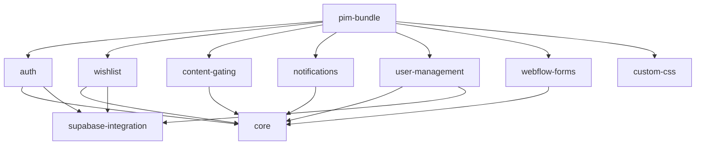
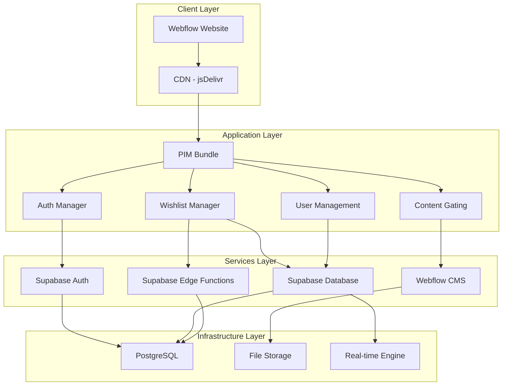

# Technical Architecture Document
## Niko Bathrooms PIM System

### **Document Information**
- **Version**: 5.0.0
- **Date**: September 2025
- **BMAD Agent**: Architect (@architect)
- **Status**: Current Production Architecture

---

## 🏗️ **Architecture Overview**

The Niko Bathrooms PIM system follows a **modular monorepo architecture** with independent, loosely-coupled packages that can be developed, tested, and deployed independently while maintaining a cohesive user experience.

### **Core Architectural Principles**
1. **Modularity**: Each package has a single responsibility
2. **Independence**: Packages can be developed and deployed separately
3. **Reusability**: Shared utilities in core package
4. **Scalability**: Horizontal scaling through package distribution
5. **Maintainability**: Clear separation of concerns
6. **Performance**: Tree-shaking and code splitting
7. **Security**: Defense in depth with multiple security layers

---

## 📦 **Package Architecture**

### **Dependency Graph**

### **Package Descriptions**

#### **🔐 auth/ - Authentication System**
- **Purpose**: Handles user authentication and authorization
- **Technology**: Supabase Auth + JWT tokens
- **Key Features**:
  - User registration with email verification
  - Role-based authentication (customer/retailer)
  - Session management and logout
  - Webflow CMS user synchronization
- **Dependencies**: `core`, `supabase-integration`
- **Bundle Size**: ~15KB gzipped

#### **🛒 wishlist/ - Product Wishlist Management**
- **Purpose**: Manages user product wishlists with hybrid storage
- **Technology**: LocalStorage + Supabase cloud persistence
- **Key Features**:
  - Add/remove products from wishlist
  - Anonymous and authenticated user support
  - Cross-device synchronization
  - Shareable wishlist URLs
- **Dependencies**: `core`, `supabase-integration`
- **Bundle Size**: ~12KB gzipped

#### **🛡️ content-gating/ - Role-Based Access Control**
- **Purpose**: Controls content visibility based on user roles
- **Technology**: DOM manipulation + authentication state
- **Key Features**:
  - Dynamic content showing/hiding
  - Role-based content rules
  - Secure DOM-level protection
  - Trade pricing for retailers
- **Dependencies**: `core`
- **Bundle Size**: ~6KB gzipped

#### **📝 webflow-forms/ - Webflow Integration**
- **Purpose**: Handles Webflow form submissions and integrations
- **Technology**: Webflow API + form handling
- **Key Features**:
  - Form submission processing
  - Registration form integration
  - Error handling and validation
  - CMS synchronization
- **Dependencies**: `core`
- **Bundle Size**: ~8KB gzipped

#### **🔔 notifications/ - User Notifications**
- **Purpose**: Provides user feedback through toast notifications
- **Technology**: Vanilla JavaScript + CSS animations
- **Key Features**:
  - Success/error toast notifications
  - Non-intrusive user feedback
  - Customizable notification styling
  - Auto-dismiss functionality
- **Dependencies**: `core`
- **Bundle Size**: ~4KB gzipped

#### **👥 user-management/ - User Profiles & Dashboard**
- **Purpose**: Manages user profiles and dashboard functionality
- **Technology**: Supabase + Webflow CMS
- **Key Features**:
  - User profile management
  - Dashboard with activity summary
  - Account settings and preferences
  - Role management interface
- **Dependencies**: `core`, `supabase-integration`, `auth`
- **Bundle Size**: ~10KB gzipped

#### **🔗 supabase-integration/ - Backend Services**
- **Purpose**: Provides backend services and database operations
- **Technology**: Supabase Edge Functions + PostgreSQL
- **Key Features**:
  - Database schema and migrations
  - Edge Functions for server-side logic
  - Real-time subscriptions
  - File storage and management
- **Dependencies**: `core`
- **Bundle Size**: ~8KB gzipped

#### **🎨 custom-css/ - Design System**
- **Purpose**: Provides consistent styling and design system
- **Technology**: Modern CSS with custom properties
- **Key Features**:
  - CSS custom properties for theming
  - Responsive design utilities
  - Animation and transition effects
  - Component-specific styling
- **Dependencies**: None
- **Bundle Size**: ~5KB gzipped

#### **⚙️ core/ - Shared Utilities**
- **Purpose**: Provides shared utilities, types, and constants
- **Technology**: TypeScript utilities
- **Key Features**:
  - Shared TypeScript types and interfaces
  - Common utility functions
  - Configuration constants
  - Validation helpers
- **Dependencies**: None
- **Bundle Size**: ~8KB gzipped

#### **📦 pim-bundle/ - Distribution Bundle**
- **Purpose**: Orchestrates and bundles all packages for distribution
- **Technology**: Rollup + Webpack bundling
- **Key Features**:
  - Tree-shaking for optimal bundle size
  - Code splitting by feature
  - CDN distribution ready
  - Development and production builds
- **Dependencies**: All other packages
- **Bundle Size**: ~45KB gzipped (complete system)

---

## 🌐 **System Architecture**

### **High-Level System Diagram**

### **Data Flow Architecture**

#### **Authentication Flow**
1. User submits login form on Webflow
2. Auth package validates credentials with Supabase
3. JWT token stored in localStorage
4. User role fetched from Supabase
5. Content gating applied based on role
6. User data synchronized with Webflow CMS

#### **Wishlist Flow**
1. User clicks "Add to Wishlist" button
2. Product ID captured by wishlist package
3. Data stored locally in localStorage
4. If authenticated, synced to Supabase cloud
5. Cross-device synchronization on login
6. Sharing URLs generated on demand

#### **Content Gating Flow**
1. Page loads with all content hidden
2. Authentication state checked
3. User role determined
4. Content rules applied based on role
5. Appropriate content shown/hidden
6. Trade pricing displayed for retailers

---

## 🔧 **Technology Stack**

### **Frontend Technologies**
- **Core Language**: TypeScript 5.5
- **Module System**: ES2022 Modules
- **Build Tools**: Rollup (libraries) + Webpack (bundling)
- **CSS**: Modern CSS with custom properties
- **Testing**: Vitest with coverage reporting

### **Backend Services**
- **Authentication**: Supabase Auth with JWT
- **Database**: Supabase PostgreSQL
- **Edge Functions**: Supabase Edge Runtime (Deno)
- **File Storage**: Supabase Storage
- **Real-time**: Supabase Realtime

### **Content Management**
- **CMS**: Webflow CMS for content
- **Forms**: Webflow Forms with custom handling
- **CDN**: jsDelivr for global distribution

### **Development Tools**
- **Package Manager**: pnpm workspaces
- **Version Control**: Git with semantic versioning
- **Code Quality**: ESLint + Prettier + TypeScript strict
- **CI/CD**: GitHub Actions for automated builds
- **Monitoring**: Error tracking and performance monitoring

---

## 🛡️ **Security Architecture**

### **Authentication & Authorization**
- **JWT Tokens**: Secure token-based authentication
- **Role-Based Access**: Customer vs Retailer permissions
- **Session Management**: Secure session handling
- **Password Security**: Supabase handles password hashing

### **Data Protection**
- **Encryption in Transit**: All API calls use HTTPS/TLS
- **Encryption at Rest**: Supabase handles database encryption
- **Input Validation**: All user inputs validated
- **SQL Injection Protection**: Parameterized queries via Supabase

### **Content Security**
- **DOM-Level Protection**: Content gating at element level
- **API Security**: Rate limiting on Edge Functions
- **CORS Configuration**: Restricted origins for API access
- **CSP Headers**: Content Security Policy implementation

### **Privacy & Compliance**
- **GDPR Compliance**: User data handling procedures
- **Data Minimization**: Only collect necessary data
- **User Consent**: Clear consent mechanisms
- **Data Retention**: Automated data cleanup policies

---

## 📊 **Performance Architecture**

### **Bundle Optimization**
- **Tree Shaking**: Eliminates unused code
- **Code Splitting**: Loads features on demand
- **Lazy Loading**: Non-critical features loaded asynchronously
- **Compression**: Gzip compression for all assets

### **Caching Strategy**
- **CDN Caching**: Global edge caching via jsDelivr
- **Browser Caching**: Optimized cache headers
- **LocalStorage**: Client-side data caching
- **Supabase Caching**: Database query optimization

### **Performance Targets**
- **Bundle Size**: <50KB gzipped (complete system)
- **Load Time**: <2 seconds on 3G connection
- **API Response**: <500ms for most operations
- **Lighthouse Score**: 90+ across all categories

---

## 🔄 **Deployment Architecture**

### **Build Process**
1. **Development**: Local development with hot reload
2. **Testing**: Automated test suite execution
3. **Building**: Package compilation and bundling
4. **Optimization**: Minification and compression
5. **Distribution**: Upload to GitHub for CDN access

### **Environment Strategy**
- **Development**: Local development environment
- **Staging**: GitHub branch for testing
- **Production**: Main branch with CDN distribution

### **Release Process**
- **Semantic Versioning**: Automated version management
- **Changelog**: Automated changelog generation
- **Distribution**: CDN cache invalidation
- **Monitoring**: Post-deployment health checks

---

## 📈 **Scalability Architecture**

### **Horizontal Scaling**
- **Package Independence**: Packages can scale independently
- **CDN Distribution**: Global content delivery
- **Database Scaling**: Supabase handles database scaling
- **Edge Functions**: Auto-scaling serverless functions

### **Performance Scaling**
- **Bundle Splitting**: Load only required packages
- **Lazy Loading**: On-demand feature loading
- **Caching Layers**: Multiple caching strategies
- **Database Optimization**: Efficient queries and indexing

### **Monitoring & Observability**
- **Error Tracking**: Automated error reporting
- **Performance Monitoring**: Real-time performance metrics
- **Usage Analytics**: User behavior tracking
- **System Health**: Uptime and reliability monitoring

---

## 🔍 **Quality Architecture**

### **Testing Strategy**
- **Unit Tests**: Individual package testing
- **Integration Tests**: Cross-package testing
- **End-to-End Tests**: Full user journey testing
- **Performance Tests**: Load and stress testing

### **Code Quality**
- **TypeScript**: Strict type checking
- **ESLint**: Code linting and standards
- **Prettier**: Consistent code formatting
- **Pre-commit Hooks**: Automated quality checks

### **Documentation**
- **API Documentation**: Comprehensive API docs
- **Architecture Docs**: System design documentation
- **User Guides**: End-user documentation
- **Contributing Guides**: Developer onboarding

---

## 🎯 **Future Architecture Considerations**

### **Planned Enhancements (v6.0)**
- **Micro-frontend Architecture**: Further package independence
- **GraphQL API**: Enhanced data fetching
- **Service Worker**: Offline functionality
- **WebAssembly**: Performance-critical operations

### **Scalability Improvements**
- **Database Sharding**: For high-volume scenarios
- **Event-Driven Architecture**: Loosely coupled services
- **API Gateway**: Centralized API management
- **Container Deployment**: Docker-based deployments

### **Technology Evolution**
- **Modern JavaScript**: ES2024+ features adoption
- **Web Standards**: Progressive Web App capabilities
- **AI Integration**: ML-powered features
- **Mobile Apps**: Native mobile applications

---

*This architecture document reflects the current state of the Niko Bathrooms PIM system and serves as a guide for future development and scaling decisions.*
