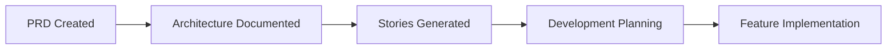

# BMAD Method Workflow Integration
## Safe Implementation for Production Systems

### **🎯 Overview**

This document outlines how to safely integrate BMAD Method into the existing Niko Bathrooms PIM production system without disrupting current operations.

---

## 🛡️ **Production Safety Guidelines**

### **Core Principles**
1. **Non-Disruptive**: BMAD operates alongside existing workflow
2. **Incremental**: Gradual adoption without breaking changes
3. **Reversible**: Easy to rollback if needed
4. **Isolated**: BMAD files separate from production code
5. **Documented**: Clear documentation for team adoption

### **What BMAD DOES NOT Touch**
- ❌ Existing production packages (`packages/` directory)
- ❌ Current build processes (`package.json` scripts)
- ❌ Deployment workflows
- ❌ Main branch until fully tested
- ❌ CDN-deployed bundles

### **What BMAD ADDS**
- ✅ Documentation in `docs/bmad/` directory
- ✅ Development stories for future features
- ✅ Enhanced project planning tools
- ✅ AI-assisted development workflow
- ✅ Code analysis and review tools

---

## 🔄 **BMAD Workflow Integration**

### **Phase 1: Documentation & Planning (CURRENT)**


#### **Completed Steps**
- ✅ **PRD Generated**: Comprehensive product requirements
- ✅ **Architecture Documented**: Current system architecture
- ✅ **BMAD Structure**: Safe documentation structure

#### **Next Steps**
- 🔄 **Story Generation**: Break down features into development stories
- ⏳ **Agent Setup**: Configure BMAD agents for development
- ⏳ **Workflow Integration**: Integrate with existing development process

### **Phase 2: Story-Driven Development**

Create development stories for upcoming features:

#### **Epic 1: Performance Optimization (v5.1)**
- Story 1.1: Bundle size optimization
- Story 1.2: Lazy loading implementation
- Story 1.3: CDN cache optimization
- Story 1.4: Performance monitoring setup

#### **Epic 2: Mobile Experience Enhancement (v5.1)**
- Story 2.1: Mobile responsive improvements
- Story 2.2: Touch interaction optimization
- Story 2.3: Mobile-specific features
- Story 2.4: Progressive Web App setup

#### **Epic 3: Advanced Features (v6.0)**
- Story 3.1: AI-powered recommendations
- Story 3.2: Enhanced collaboration tools
- Story 3.3: Advanced analytics
- Story 3.4: Mobile app development

---

## 🤖 **BMAD Agent Configuration**

### **Available Agents for Development**

#### **@pm (Product Manager)**
- **Role**: Feature planning and requirements
- **Usage**: `@pm Create user story for mobile wishlist optimization`
- **Output**: Detailed user stories with acceptance criteria

#### **@architect (System Architect)**
- **Role**: Technical design and architecture decisions
- **Usage**: `@architect Design mobile-first responsive system`
- **Output**: Architecture diagrams and technical specifications

#### **@dev (Developer)**
- **Role**: Code implementation and development
- **Usage**: `@dev Implement story 1.2 - lazy loading for wishlist`
- **Output**: Production-ready code with tests

#### **@qa (Quality Assurance)**
- **Role**: Testing and quality validation
- **Usage**: `@qa Review story 1.2 implementation and create tests`
- **Output**: Test plans, test cases, and quality reports

#### **@sm (Scrum Master)**
- **Role**: Story management and workflow coordination
- **Usage**: `@sm Break down Epic 1 into implementable stories`
- **Output**: Detailed development stories with dependencies

---

## 📋 **Story Template**

### **Story Format**
```markdown
## Story [ID]: [Title]

### 📋 Description
Brief description of the feature/improvement

### 🎯 Acceptance Criteria
- [ ] Criterion 1
- [ ] Criterion 2
- [ ] Criterion 3

### 🔧 Technical Requirements
- Implementation approach
- Dependencies
- Performance requirements

### 🧪 Testing Requirements
- Unit tests needed
- Integration tests needed
- Manual testing checklist

### 📊 Success Metrics
- How success will be measured
- Performance targets
- User impact goals

### 🔗 Dependencies
- Other stories that must complete first
- External dependencies
- Resource requirements

### 📝 Implementation Notes
- Detailed implementation guidance
- Code patterns to follow
- Best practices to apply

### ✅ Definition of Done
- [ ] Code implemented and reviewed
- [ ] Tests written and passing
- [ ] Documentation updated
- [ ] Performance benchmarks met
- [ ] Security review completed
- [ ] Deployed to staging
- [ ] User acceptance testing completed
```

---

## 🛠️ **Development Workflow with BMAD**

### **Current Workflow (PRESERVED)**
```
Feature Request → Development → Testing → Deploy → Monitor
```

### **Enhanced Workflow with BMAD**
```mermaid
graph TD
    A[Feature Request] --> B[@pm Create Story]
    B --> C[@architect Design Solution]
    C --> D[@dev Implement Feature]
    D --> E[@qa Review & Test]
    E --> F{Review Complete?}
    F -->|No| D
    F -->|Yes| G[Deploy to Staging]
    G --> H[User Testing]
    H --> I[Deploy to Production]
    I --> J[Monitor & Analyze]
```

### **Story-Driven Development Process**

#### **Step 1: Story Creation**
1. Product owner/stakeholder creates feature request
2. Use `@pm` agent to create detailed story
3. Story includes all context and requirements

#### **Step 2: Technical Design**
1. Use `@architect` agent for technical design
2. Review current architecture
3. Design implementation approach

#### **Step 3: Implementation**
1. Use `@dev` agent for code implementation
2. Follow story requirements exactly
3. Include comprehensive tests

#### **Step 4: Quality Assurance**
1. Use `@qa` agent for review
2. Validate against acceptance criteria
3. Perform thorough testing

#### **Step 5: Deployment**
1. Standard deployment process (unchanged)
2. Monitor performance and user feedback
3. Update story status

---

## 📁 **BMAD Directory Structure**

### **Safe Implementation Structure**
```
niko-bathrooms-pim/
├── packages/                    # 🔒 PRODUCTION (unchanged)
├── docs/
│   └── bmad/                   # ✅ BMAD SAFE ZONE
│       ├── README.md           # Implementation overview
│       ├── PRD.md              # Product requirements
│       ├── Architecture.md     # Technical architecture
│       ├── workflow/           # BMAD workflow docs
│       └── stories/            # Development stories
│           ├── epic-1-performance/
│           ├── epic-2-mobile/
│           └── epic-3-advanced/
├── .bmad-core/                 # ✅ BMAD AGENTS (if installed)
└── package.json                # 🔒 PRODUCTION (unchanged)
```

### **Story Organization**
Each epic contains focused stories:
```
stories/epic-1-performance/
├── story-1.1-bundle-optimization.md
├── story-1.2-lazy-loading.md
├── story-1.3-cdn-optimization.md
└── story-1.4-monitoring.md
```

---

## 🔄 **Migration Timeline**

### **Week 1: Foundation (COMPLETE)**
- ✅ Create BMAD branch
- ✅ Add documentation structure
- ✅ Generate PRD and Architecture docs
- ✅ Establish workflow guidelines

### **Week 2: Story Generation**
- 🔄 Create Epic 1 (Performance) stories
- 🔄 Create Epic 2 (Mobile) stories
- 🔄 Set up story templates
- 🔄 Team training on BMAD workflow

### **Week 3: Pilot Implementation**
- ⏳ Implement one small story using BMAD
- ⏳ Test the complete workflow
- ⏳ Gather team feedback
- ⏳ Refine process

### **Week 4: Full Integration**
- ⏳ Apply BMAD to all new features
- ⏳ Integrate with existing tools
- ⏳ Document lessons learned
- ⏳ Plan next phase

---

## ✅ **Benefits of BMAD Integration**

### **For Development Team**
- **Clear Context**: Every story contains complete implementation context
- **Consistent Quality**: Standardized story format and requirements
- **Reduced Meetings**: Stories contain all necessary information
- **Better Planning**: Detailed stories improve estimation accuracy

### **For Product Management**
- **Comprehensive Documentation**: PRD and architecture always up-to-date
- **Traceability**: Clear connection between requirements and implementation
- **Risk Reduction**: Thorough planning reduces development risks
- **Stakeholder Alignment**: Clear documentation improves communication

### **For Business**
- **Faster Development**: Reduced context switching and clarification needs
- **Higher Quality**: Comprehensive testing and review process
- **Better Outcomes**: Clear success criteria and acceptance testing
- **Reduced Costs**: Fewer bugs and rework through better planning

---

## 🚨 **Risk Mitigation**

### **Technical Risks**
- **Risk**: BMAD conflicts with existing tools
- **Mitigation**: BMAD operates in isolated directory structure

### **Process Risks**
- **Risk**: Team resistance to new workflow
- **Mitigation**: Gradual adoption with training and support

### **Business Risks**
- **Risk**: Slower initial development
- **Mitigation**: Start with small stories to build momentum

### **Quality Risks**
- **Risk**: Over-documentation slowing development
- **Mitigation**: Focus on essential documentation only

---

## 📞 **Support & Resources**

### **Getting Help**
- **BMAD Documentation**: Comprehensive guides in `docs/bmad/`
- **Team Training**: Hands-on workshops and pair programming
- **Escalation Path**: Clear process for resolving issues
- **Feedback Loop**: Regular retrospectives and improvements

### **Success Metrics**
- **Story Completion Rate**: Target 95% stories completed on time
- **Code Quality**: Reduced bugs and improved test coverage
- **Team Satisfaction**: Positive feedback on new workflow
- **Business Impact**: Faster feature delivery and better outcomes

---

*This workflow integration ensures BMAD Method enhances rather than disrupts the existing production system, providing a safe path to improved development practices.*
